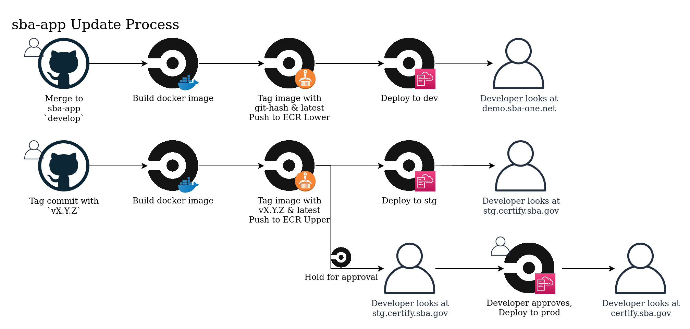

## sba-app

[](https://hakiri.io/projects/62605bd5f1c244/stacks/9a2a98f9946892/shield)

The project that powered <https://certify.sba.gov/>.
change

## Prerequisite

- Valid installation of [Redis][]
- Valid installtion of [PostgreSQL][]
- Valid installtion of [Elasticsearch][]

## Prerequisite Setup (MacOS - High Sierra)

### Install xcode

from a terminal prompt, run the following:

    xcode-select --install

### Install Homebrew

```sh
/usr/bin/ruby -e "$(curl -fsSL https://raw.githubusercontent.com/Homebrew/install/master/install)"
```

Review the output and follow any provided instructions. [Full info on Homebrew here](https://github.com/mxcl/homebrew/wiki/installation). Once installation is complete, run `brew doctor` to check that everything is setup correctly.

Remember to regularly run `brew update` and `brew doctor` when doing new installs to make sure you are up to date and still configured correctly. To upgrade your existing packages, run `brew upgrade`.

### Install git

    brew update
    brew install git
    git config --global user.name "Your Full Name"
    git config --global user.email "Your Email Address"

### Install RVM & Ruby

first, (optionally) disable documentation for gems since they add a lot of time to the install and don't add much value

    echo "gem: --no-document" >> ~/.gemrc

next, install rvm

    curl -L https://get.rvm.io | bash -s stable --rails --autolibs=enable --ruby=2.3.3

This will take a few minutes, and once it’s done, QUIT and relaunch Terminal, then run this command:

    type rvm | head -1

If you get `rvm is a function`, that means RVM was successfully installed.

    rvm -v (You should get rvm 1.26.11 or higher)

To make sure the latest versions of RVM and Ruby were installed, run the commands below.

You can use `rvm get stable` to upgrade to the latest rvm.

Set default version of Ruby:

    rvm list rubies (list all versions of Ruby installed)
    rvm install ruby-2.3.3 --default
    rvm use ruby-2.3.3 --default
    ruby -v
    # should get ruby 2.3.3

### Install Java
NOTE: Elasticsearch 5.6 uses Java 1.8; this specific version is no longer available through OpenJDK. ES has been tested with AdoptOpenJDK.

```sh
# Install Java runtime using Homebrew
brew cask install adoptopenjdk8
```

### Install Elasticsearch 5.6
NOTE: ES v5.6 is no longer available for installation through homebrew. Download the archive from the following link: [https://www.elastic.co/downloads/past-releases/elasticsearch-5-6-16](https://www.elastic.co/downloads/past-releases/elasticsearch-5-6-16)

Start at the console with the following command:

```sh
# NOTE: for the example below ES was installed into ~/opt
$ JAVA_HOME=/Library/Java/JavaVirtualMachines/adoptopenjdk-8.jdk/Contents/Home ~/opt/elasticsearch-5.6.16/bin/elasticsearch
```

### Install Redis

```sh
# Install Redis using Homebrew
brew install redis

# Enable Redis autostart
ln -sfv /usr/local/opt/redis/*.plist ~/Library/LaunchAgents

# Start Redis server via launchctl
launchctl load ~/Library/LaunchAgents/homebrew.mxcl.redis.plist

# Start Redis server using configuration file, Ctrl+C to stop
redis-server /usr/local/etc/redis.conf

# Check if the Redis server is running
redis-cli ping
```

### Setup PostgreSQL 9.4

```sh
# Install PostgreSQL 9.4
brew install postgres

# Start postgresql service every time you restart your computer.
brew services start postgres

# create a superuser postgres
createuser -d -a -s -P postgres

# *Note: If the above doesn't work, you can download the mac 9.4 package from the following links:
https://www.postgresql.org/download/macosx/
https://postgresapp.com/downloads.html
```

# Basic Setup

- You might like to export the following variables for local test/development. Also review the file .sba-app-dev.env for a canonical set of environment variables.

If you are running Unix based system (Linux/MacOs)

```sh
# Add this to your ~/.bashrc or ~/.zshrc
export RDS_URL=localhost
export RDS_DB_NAME=sbaone_dev
export RDS_USER=<USER>
export RDS_PASSWORD=<PASSWORD>

# Add this to have the logger display in your terminal.
export RAILS_LOG_TO_STDOUT='yes'

# Adjust the password to your setup
export RDS_TEST_URL=localhost
export RDS_TEST_DB_NAME=sbaone_test
export RDS_TEST_USER=<USER>
export RDS_TEST_PASSWORD=<PASSWORD>

export RDS_ADMIN_USER=<USER>
export RDS_ADMIN_PASSWORD=<PASSWORD>
export SESSION_REDIS_URL=redis://host:6379/2

export ELASTIC_SEARCH_CLUSTER="localhost:9200"

# Recaptcha test keys - https://developers.google.com/recaptcha/docs/faq
export RECAPTCHA_PRIVATE_KEY="6LeIxAcTAAAAAGG-vFI1TnRWxMZNFuojJ4WifJWe"
export RECAPTCHA_PUBLIC_KEY="6LeIxAcTAAAAAJcZVRqyHh71UMIEGNQ_MXjiZKhI"

# IdP ENV variables
export SBA_IDP_ISSUER="http://localhost:3000/"
export SBA_IDP_HOST="localhost"
export SBA_IDP_PORT="3000"
export SBA_IDP_IDENTIFIER="ss:landingapp:localhost:3200"
export SBA_REDIRECT_URI="http://localhost:3200/users/auth/sba_idp/callback"
export SBA_IDP_PASSPHRASE="hunter2"
export SBA_IDP_KEY_PATH="fake_sba_idp_test.key"
export MAX_ASSERTION_LEVEL="http://idmanagement.gov/icam/2009/12/saml_2.0_profile/assurancelevel2"
```

# Adding a comment to trigger build

## Setup and run the app locally

Assume that you have [PostgreSQL][], [Redis][], and [Elasticsearch][] running locally

```sh
# Only need to run this the first time
$ bundle config geminabox.sba-one.net <username>:<password>
$ brew install gcc v8@3.15
$ bundle config build.libv8 --with-system-v8
$ bundle config build.therubyracer --with-v8-dir=$(brew --prefix v8@3.15)
$ bundle install
$ RAILS_ENV=development rake db:create

# Run the migration
$ RAILS_ENV=development rake db:migrate

# Populate the sample database with seeds file
$ RAILS_ENV=development rake db:seed
```

If you like to run the test, you may also need to run similar command but for `test` mode

```sh
# Only need to run this the first time
RAILS_ENV=test bundle exec rake db:setup

# Run the migration
RAILS_ENV=test bundle exec rake db:migrate

# Populate the sample database with seeds file
RAILS_ENV=test bundle exec rake db:seed

# Now you can run the rails tests using, please be patient as this will take sometime to complete
bundle exec rake spec

# To run full tests including some happy path integration tests
bundle exec rake spec:full

# You should now be able to see the test result
```

Once this is done, then the result of the test is available at `coverage/index.html` and `coverage/specs.html`

## Latest updates to setup and run rspec tests

## To setup the environment, execute the bash script as below for development

`./drop-create-migrate-seed develop`

## To setup the environment, execute the bash script as below for test

`./drop-create-migrate-seed test`

and start specific rspec feature by executing
`rspec spec/features/xyz.rb`

or execute specific scenario line
`rspec spec/features/xyz.rb:line_number`

### Startup the development server locally quickly

First you must clone the repo and bundle install

```sh
git clone git@github.com:USSBA/sba-app.git
cd sba-app
gem install bundler
bundle
```

Provided that you have the right setup above, you should be able to run the code
locally using the following script in one simple shell script.

```sh
#!/bin/bash
RAILS_ENV=${RAILS_ENV:=development}
echo "Using RAILS_ENV=$RAILS_ENV"
RAILS_ENV=$RAILS_ENV bundle exec rake db:drop
RAILS_ENV=$RAILS_ENV bundle exec rake db:create
RAILS_ENV=$RAILS_ENV bundle exec rake db:migrate
RAILS_ENV=$RAILS_ENV bundle exec rake db:seed
```

Just `./drop-create-migrate-seed`

Then start the rails server

```sh
rails server
```

### Mailer queue via Redis jobs

```sh
RAILS_ENV=development BACKGROUND=yes QUEUE=* rake resque:work
```

## Messages & Notifications Integration

Clone the message-api project and follow the directions here: <https://github.com/USSBA/message-api>

Clone the notification-api project and follow the directions here: <https://github.com/USSBA/notification-api>

Update your ~/.bashrc or ~/.zshrc to include the following environment variables:

```sh
export ENV["MESSAGE_API_URL"]=http://localhost:3001
export ENV["NOTIFICATION_API_URL"]=http://localhost:3004
```

## Docker

You can bring up all of the services needed to run the Certify app as well as the app itself using `docker-compose up`.

### Environment Set-up:

The docker composition is configured to send email to MailCatcher rather than outside the docker container network.

All other environment configuration settings for the local run of docker can be found in file:
docker/docker.env.
N.B.: If the API services seem out of date, run `git submodule update --remote` to get the latest code.
This should be good for everyone's local build.

### Launching

#### Inital launch:

    docker-compose up

This docker-compose uses the same image that is used for the CircleCi docker image builds and the resulting images uploaded into ECS.
\*Note: The first time you run docker-compose up, expect a download/build phase of approx 10min. After that, subsequent invocations should be very fast.

#### Building with new code

    git fetch # (or pull)
    docker-compose build
    docker-compose up

For more information on docker-compose:

    docker-compose help

## Installing & running cucumber locally

### Installation:

#### Install the chrome browser:

<https://www.google.com/chrome/?brand=CHBD&gclid=EAIaIQobChMIhZm328uy2gIVlY7ICh2oHAJ8EAAYASAAEgL0C_D_BwE&gclsrc=aw.ds&dclid=CKSh0N7LstoCFRUIgQod2DsMxw>

<https://www.kenst.com/2015/03/installing-chromedriver-on-mac-osx/>

#### Install the chrome driver:

brew cask install chromedriver

Make sure the chromedriver can be found via your PATH var, if not, update /etc/paths (sudo vi /etc/paths)
For more info, see this link: <https://sites.google.com/a/chromium.org/chromedriver/downloads>

#### Install mini-magic

brew install graphicsmagick

### Running cucumber locally

1. launch the server locally via rails s (use RAILS_ENV = test)
2. rake features CUCUMBER_TAGS=@login (Doesn't work from release 4.7.0 changes)
3. bundle exec cucumber --tags @login (where @login is the specific tag)


## dsbs.rake in a local environment. 
In order to work with dsbs.rake in a local non docker environment, make the following changes. Be sure to revert the changes before pushing to production.
### Mailcatcher
dsbs.rake will email a copy of the .csv file. Mailcatcher will help debug the emailing. 

1. Run the mailcatcher server locally. 
2. Change the SMTP server in config/environments/development.rb to user the mailcatcher configuration

### SFTP
dsbs.rake uses SFTP to connect to the Minerva server. The credentials are not available locally. This functionality can be disabled by commenting out the appropriate line in lib/exporter/base.rb in the run method that calls 'export_file'

### export RAILS_LOG_TO_STDOUT='yes'
For local development, run `export RAILS_LOG_TO_STDOUT='yes'` which will redirect the logger. 

## Tips

### Good setup to keep the code clean

We have not talked about the standard style guide, but I feel that this is a good place to start.
At the least, this will make it easy when we have to do the code review/collaborate on the same part of
the code.

- Setup your IDE/editor to trim trailing spaces on save
- See [this links](https://gist.github.com/jandudulski/4451806) for RubyMine, Sublime Text, or Vim
- Or [this link for Sublime Text](https://github.com/SublimeText/TrailingSpaces)

[postgresql]: https://www.postgresql.org/
[redis]: http://redis.io/
[elasticsearch]: https://www.elastic.co/
[artifactory]: https://www.jfrog.com/artifactory/
[local gemserver]: http://artifactory.maint.sba-one.net:8081/artifactory/webapp/#/home

## Deployment

### Deployment Pipeline



Ruby -v 2.4.10 <br>
Rails -v 4.2.11 
